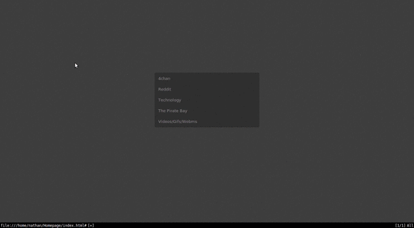

# my_startpage

This is my current homepage project. 

Edit this to change the background:
```css
body {
  background-image: url("bg.png");
  margin: 0;
  padding: 0;
	font-family: sans-serif;
	overflow: hidden;
	font-size: 10pt;
}
```  

Or this for speed:
```html
<script>
  $('.subMenu').hide();
  $("li:has(ul)").click(function(){
  $("ul",this).slideToggle('slow');
  });
</script>
```

Action shot:


